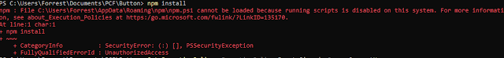
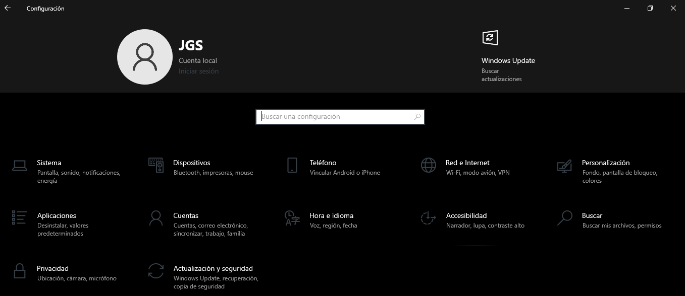
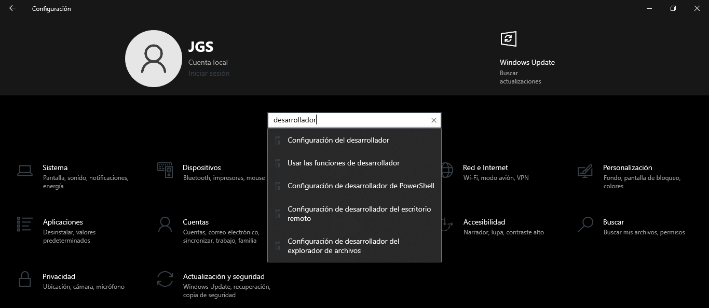
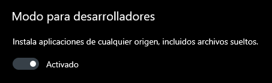
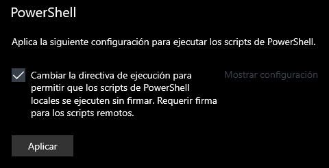

# 🚀 Template de Proyecto Node.js

Autor: Iván Talijancic

## 📋 Instrucciones de Uso

Para ejecutar este proyecto Template, sigue las siguientes instrucciones:

1. **Copiá esta carpeta `template/`** a donde quieras trabajar, y renombrala (por ejemplo, `unidad-02`). Hacé **una copia por unidad**: así te queda el historial de lo que fuiste resolviendo.

   Si todavía no clonaste el repositorio de la cátedra, podés bajarlo como ZIP desde [pc-2026](https://github.com/italijancic/pc-2026).

2. **Abrí la carpeta con VSCode:** **asegurate de abrir la carpeta raíz**, la que contiene el `package.json`. Esto es muy importante: si abrís `src/`, no vas a poder ejecutar el proyecto.

3. **Instalar dependencias:** Si no se han instalado las dependencias del proyecto (si no ves la carpeta `node_modules` en tu proyecto), ejecuta en tu consola `npm install`. En caso de tener dificultades con Powershell vaya a [Troubleshooting](#-troubleshooting)

4. **Ejecutar el proyecto:** En tu consola (terminal de VSCode), ejecuta `npm run dev`.

## 📂 Contenido del Repositorio

### 1. `package.json`

Este archivo define la configuración del proyecto, incluyendo las dependencias, scripts y metadatos.

- **name:** Nombre del proyecto.
- **version:** Versión del proyecto.
- **description:** Descripción del proyecto.
- **type:** Define que el proyecto usa módulos `ECMAScript`.
- **main:** Archivo principal del proyecto (`app.js`).
- **scripts:**
  - `dev:` Ejecuta el archivo `app.js` en modo de observación (watch mode): cada vez que guardás, se vuelve a ejecutar solo.
  - `lint:` Revisa que el código cumpla las reglas de estilo de la cátedra.
- **author:** Autor del proyecto.
- **license:** Licencia del proyecto.
- **devDependencies:** Dependencias para el desarrollo, incluyendo ESLint para análisis estático del código.
- **dependencies:** Dependencias del proyecto, en este caso `readline-sync` para leer entradas del usuario.

### 2. `eslint.config.mjs`

Configuración de ESLint para asegurar que el código siga las mejores prácticas. Usa el plugin `@eslint/js` y configura los globals necesarios.

### 3. `app.js`

Archivo principal que contiene ejemplos de cómo leer entradas desde la consola usando el módulo `prompt`.

**Ejemplos en `app.js`:**

- Leer una cadena de texto (nombre del usuario).
- Leer un número entero (edad del usuario).
- Leer un número flotante (altura del usuario).

### 4. `prompt.js`

Módulo que proporciona una función `prompt` para leer entradas desde la consola usando `readline-sync`.

## 📝 Ejemplos de Uso

### Leer una Cadena de Texto

El programa pedirá el nombre del usuario y luego lo saludarán.

```javascript
import { prompt } from './prompt.js'

const name = prompt('¿Cómo te llamás? ')
console.log(`Hola ${name}, bienvenido a Programación en Computación 2026 | UTN - FRRQ`)
```

### Leer un Número Entero

El programa pedirá la edad del usuario y la mostrará en consola.

```javascript
const age = parseInt(prompt('¿Cuántos años tenés? '))
console.log(`${name} tiene ${age} años`)
```

### Leer un Número Flotante

El programa pedirá la altura del usuario en metros y la mostrará en consola.

```javascript
const height = parseFloat(prompt('¿Cuánto medís [m]? '))
console.log(`${name} mide ${height.toFixed(2)} m`)
```

> ⚠️ `prompt()` devuelve **siempre texto**. Si el dato es un número y lo vas a usar para
> calcular, convertilo con `parseInt()` o `parseFloat()`. Si no, `20 + 5` te va a dar `205`.

## 👾 Troubleshooting

### Powershell no nos permite ejecutar el comando `npm install`

En caso de ejecutar el comando `npm install` en la terminal de Visual Studio Code y que esta nos devuelva el siguiente error o parecido:

<figure>
    
</figure>

Lo que deberemos realizar es ir a nuestra configuración de Windows y escribir en el buscador `Configuración de desarrollador`





Una vez dentro de la configuración de desarrollador, deberemos activar la opción de `Modo para desarrolladores` y habilitar la directiva que habilita todos los scripts para PowerShell.

<figure>
    
</figure>
<figure>
    
</figure>

Una vez esas dos opciones estén habilitadas, deberemos hacer clic en el botón de `Aplicar` y, ya con esto, podremos utilizar el comando `npm install`
